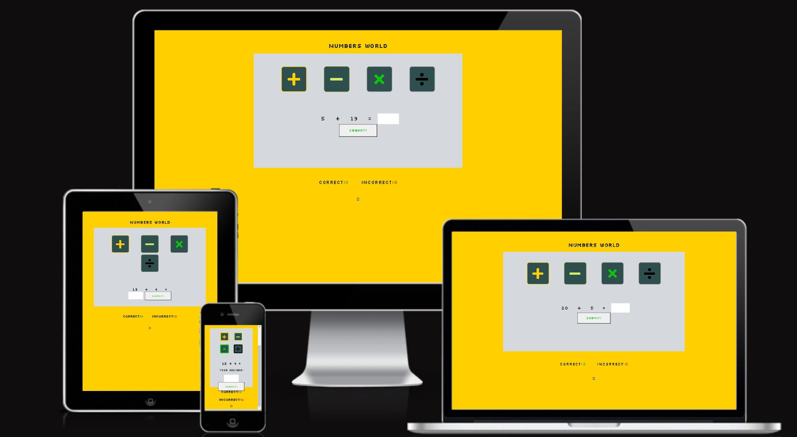
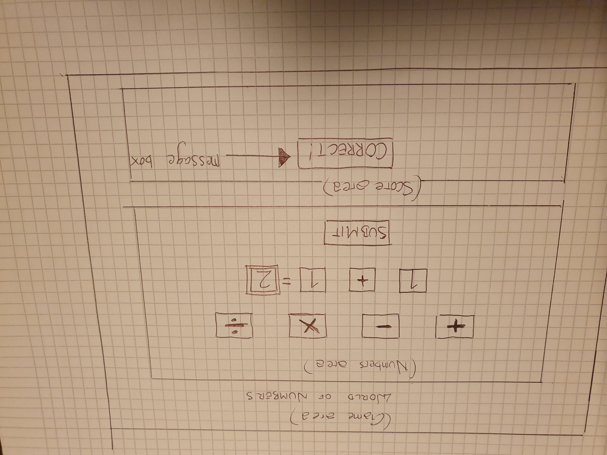
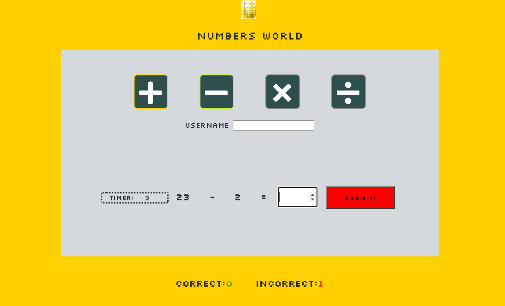
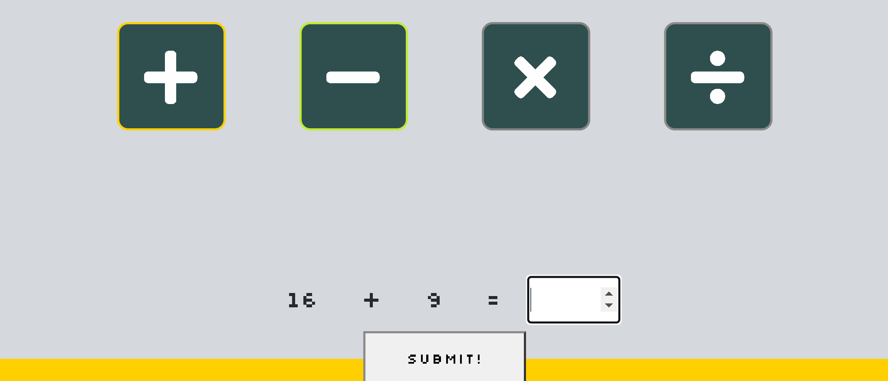
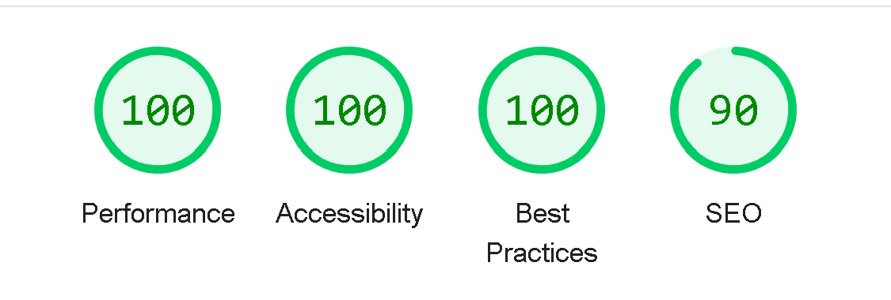
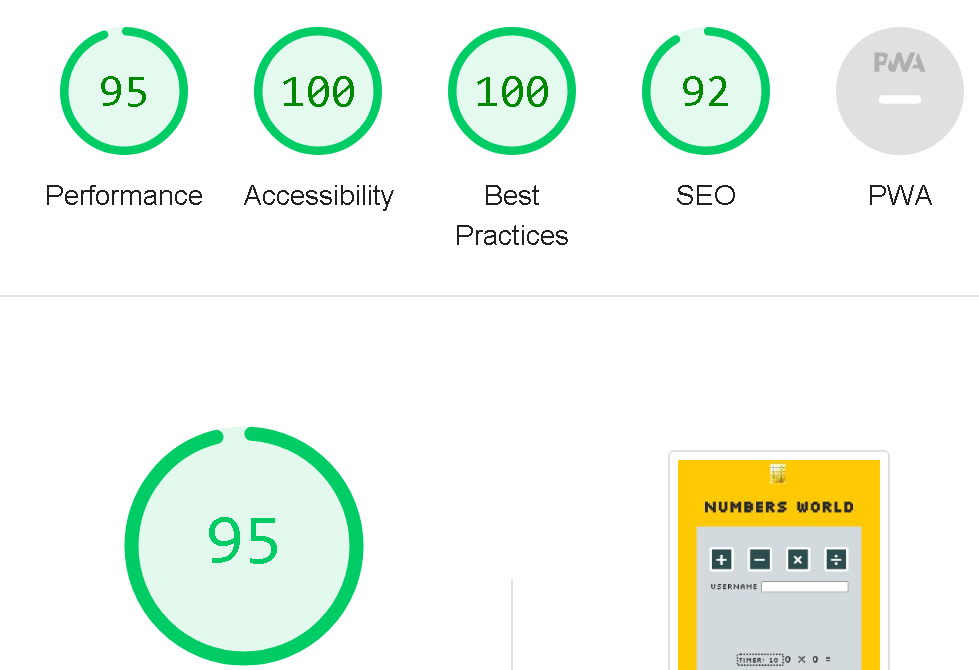

<h1 align="center">Numbers World</h1>
<h2 align="center">A web based maths game which tests the players basic knowledge</h2>
Numbers World is a simple and easy-to-play web based game which allows the players to test their basic knowledge of the subject of maths, choosing between the four calculation methods. The game is a great way to test your math skills on the go, either by the computer, on your phone or on a tablet. 

Table of Contents
- Site Owner Goals(#site-owner-goals)
- User Stories(#user-stories)
- Design(#design)
- Features(#features)
- Testing(#testing)
- Deployment(#deployment)
- Technologies Used(#technologies-used)
- Credits(#credits)
- Acknowledgements(#acknowledgements)

  
## Site Owner Goals
- To offer easy and comprehensive maths learning.
- For the user to jog their basic math knowledge frequently.
- For the user to easily choose between the four calculation methods.
- To provide feedback to the user on the submitted answer.
- Helping the user to keep score of the progress in the game.
- To provide an easily accessible user interface.

## User Stories

 ### First Time User
 - The user will be able to start playing instantly.
 - No registration is required.
 - The user can put in the answer into the answer-box and get the result.
 - The user will get returning feedback instantly.

  
 ### Returning user
 - A returning user can easily start a new game.
 - The user will be familiar with the user interface and the rules of the game.
 - The player can always start a new game, but will not be able tu resume older games.
 - A returning user can improve on his or her math skills by frequent playing.  
 - As the game generates random numbers, the game will not be exhausted.
  
 ### Frequent user
 - A frequent user can easily navigate the user interface and get into the game. 
 - The user will improve on the skills rapidly, by practicing the calculation methods. 
 - The user will be comfortable with the rules of the game and keep score easily.

## Design

### Imagery
- The game is very sparse on images. It has a few smaller pictures, though - one being the custom logotype and a favicon as well. The limited use of images in the game provides for maximum accessibility as the user will easily understand how to play the game. 

### Colour Scheme
- The colours for this game is based on the sleeve design of Kraftwerk's classic record "Computer World". Dominating values are of course yellow and grey, but there are also values of green, red and orange. The main goal with the choice of colours was to hint at the record and more specifically the songs "Numbers" and "Pocket Calculator". These colours, combined with the font, should provide a retro feel to the game as well. 

### Fonts
- For this game I chose the font "silkscreen", a Google font which was designed by Jason Kottke. This font has a very retro-styled character to it, which brings to mind old computer games from the 80's. 

### Layout
- The layout of the page is divided into the following sections:
* Game section
* Score section

### Wireframes
- The wireframe was made with pen and paper.

## Features

### Landing Page

The landing page consists of a heading, a game section and a score section. The heading displays the name of the game as well as a logo. 

### Game Section

- In the game section there are four buttons which gives the user the opportunity to choose between the four calculation methods. Below the buttons you find the randomly generated numbers together with the calculation method of choice. To the right you find the answer-box in which you can type the answer. The player can dial in the answer either with the keyboard or by using the arrows in the answer-box. To submit the answer the player can either click the "submit"button or hit "enter" on the keyboard. A feedback text will appear on the screen, displaying feedback to the user. If the answer is correct, the text will say "You submitted the correct answer!". If the answer is wrong, the text will tell the player the value of the answer and what the real answer is. For example if the player inaccurately submits the answer "31" to the numbers 16 + 16, the feedback text will say "Your answer is 31. The correct answer should be 32!" A timeout of two seconds will engage before another challenge will appear. When the player wants to change calculation method, it's easily done by clicking another of the four buttons displaying the methods. The player is free to play as long as desired, as the game continuosly generates new random numbers to calculate. 

#### Score section

- In this section, the player can keep score of the progress of the game. The section consists of two areas - the "Correct"-area and the "Incorrect"-area. Every time the player submits a correct answer, the value in the "Correct"-area increases by "1". Every time the player submits an incorrect answer, the value in the "Incrrect"-area increases by "1". The values in the "Correct"-area has a green colour and the values in the "Incorrect"-area has a red colour.

### Features Left to Implement
- No further features are planned for implementation.
There was a plan for a popup-window instead of an alert-box to display feedback to the player, but this code was changed to a text-message in the game section, for a cleaner and more accessible look.

## Testing

[Responsinator - link](http://www.responsinator.com/?url=https%3A%2F%2F8000-dym077-numbersgame1-mdgu2qm29xj.ws-eu107.gitpod.io%2F)

[Am I Responsive - link](https://ui.dev/amiresponsive?url=https://8000-dym077-numbersgame1-mdgu2qm29xj.ws-eu107.gitpod.io/)

### Validator Testing
 #### HTML
- HTML code was validated using [The W3C Markup Validator - link] (https://validator.w3.org/nu) which returned no errors or warnings.
    #### CSS
    - The CSS was tested with [The W3C CSS Jigsaw Validator - link](https://jigsaw.w3.org/css-validator/) and returned no errors or warnings.
    
#### Javascript
 - JavaScript code was tested with [JS Hint - link](https://jshint.com/) which returned 21 warnings.
 'let' is available in ES6 (use 'esversion: 6') or Mozilla JS extensions (use moz).
7	'let' is available in ES6 (use 'esversion: 6') or Mozilla JS extensions (use moz).
7	'for of' is available in ES6 (use 'esversion: 6') or Mozilla JS extensions (use moz).
12	'let' is available in ES6 (use 'esversion: 6') or Mozilla JS extensions (use moz).
8	Functions declared within loops referencing an outer scoped variable may lead to confusing semantics. (verifyAnswer, runGame)
39	'let' is available in ES6 (use 'esversion: 6') or Mozilla JS extensions (use moz).
40	'let' is available in ES6 (use 'esversion: 6') or Mozilla JS extensions (use moz).
51	'template literal syntax' is only available in ES6 (use 'esversion: 6').
52	'template literal syntax' is only available in ES6 (use 'esversion: 6').
60	'let' is available in ES6 (use 'esversion: 6') or Mozilla JS extensions (use moz).
61	'let' is available in ES6 (use 'esversion: 6') or Mozilla JS extensions (use moz).
62	'let' is available in ES6 (use 'esversion: 6') or Mozilla JS extensions (use moz).
70	'template literal syntax' is only available in ES6 (use 'esversion: 6').
74	'arrow function syntax (=>)' is only available in ES6 (use 'esversion: 6').
88	'let' is available in ES6 (use 'esversion: 6') or Mozilla JS extensions (use moz).
89	'let' is available in ES6 (use 'esversion: 6') or Mozilla JS extensions (use moz).
90	'let' is available in ES6 (use 'esversion: 6') or Mozilla JS extensions (use moz).
101	'template literal syntax' is only available in ES6 (use 'esversion: 6').
102	'template literal syntax' is only available in ES6 (use 'esversion: 6').
112	'let' is available in ES6 (use 'esversion: 6') or Mozilla JS extensions (use moz).
120	'let' is available in ES6 (use 'esversion: 6') or Mozilla JS extensions (use moz).

These warnings cause no trouble in the functionality of the game so they are left in there. 
  
  

### Accessibility 
- The site has achieved a Lighthouse accessibility score of 77%.

### Input Testing
- When the player inputs the answer into the answer-box, the feedback text will return feedback to the user, either confirming the users correct answer or telling the player what the correct answer should be. If the player has not put an answer in the answer-box and clicks "submit" the feedback will tel the player that the answer is NAN, followed by the correct answer.

### Button Testing
- When hovering over the buttons with the mouse, the colours will change slightly to indicate that the player is about to choose the particular option the button provides. When clicked, the buttons with the calculation methods instantly will provide random numbers. When the "submit"-button is clicked, the game will return feedback to the player. All buttons have been tested and work properly. 

### Game Testing
- The game has been frequently tested by the user during the development process.

### Browser Testing
- The game is tested in Google Chrome, Safari and Microsoft Edge. No problems have been reported.

    
### Device Testing
- The game has been tested with laptops, desktops, Samsung galaxy phones and iPhones.
No user has reported any problems with the game.

### Known Bugs
- No known bugs.

## Technologies Used

### Languages
- JavaScript
- HTML5
- CSS

### Frameworks, libraries and programs used for this project
 - [Am I Responsive](http://ami.responsivedesign.is/) - Used to verify responsiveness of the site on different devices.
- [Responsinator](http://www.responsinator.com/) - Used to verify responsiveness of the site on different devices.
- [Chrome Dev Tools](https://developer.chrome.com/docs/devtools/) - Used for supervision, including testing responsiveness and performance.
- [Font Awesome](https://fontawesome.com/) - Used for icons in math buttons.
- [GitHub](https://github.com/) - Used for and hosting and version control.
- [Google Fonts](https://fonts.google.com/) - Used to import and use fonts on the page.
- [W3C](https://www.w3.org/) - Used for validation HTML & CSS.
- [Favicon](https://favicon.io/) - Used to create a custom favicon.

## Deployment
- The project was deployed to Github pages using the following steps:

1. Log into Github and locate the [Github repository](https://github.com/Dym077/numbers-game)
2. Click on the settings icon at the top of the repository.
3. Scroll down to the Github pages section  
4. Find the **source** select **main** by "Deploy from a branch, next to "Root".
5. Click save, and refresh the page.

## Credits

### Content
- The inspiration for the layout of this game came from the classic album "Computer World" by Kraftwerk and retro games from the 80's. 

### Media
- Images (the logo - numbers keypad, and the favicon) are custom photos from the owner's private library.

### Resources Used
- [Math Game With Javascript -Link](https://www.youtube.com/watch?v=AF6vGYIyV8M)
- [How To Make A Popup Using HTML, CSS And JavaScript -Link](https://www.youtube.com/watch?v=AF6vGYIyV8M&t=4s)
- The Love Maths-walkthrough lessons by Code Institute.

## Acknowledgments
- My mentor Antonio for his useful advice and support.
- The Slack community of Code institute for their kind advice and support.

