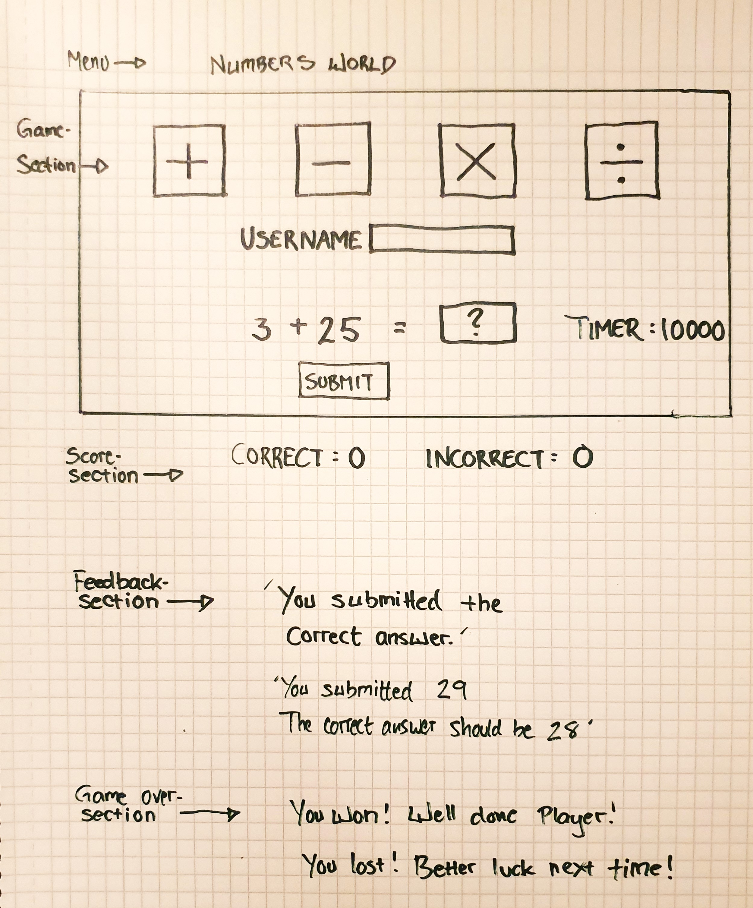
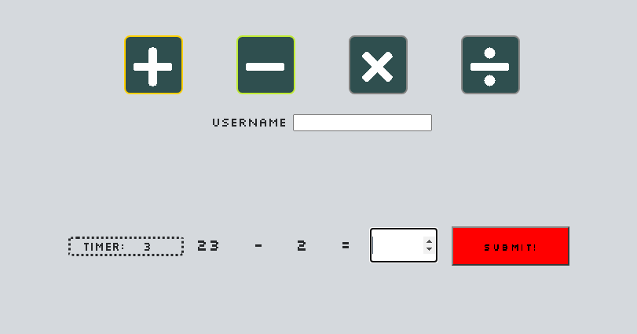
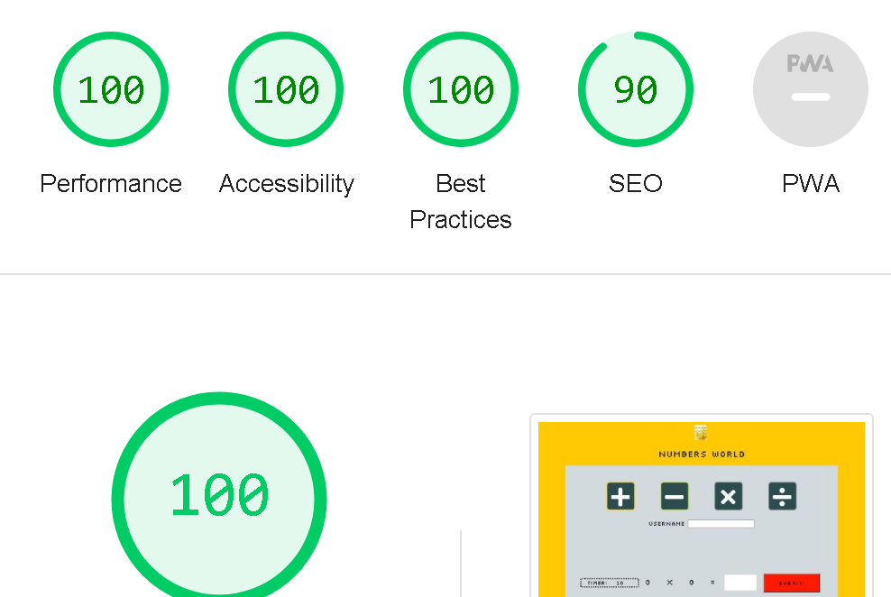

<h1 align="center">Numbers World</h1>
<h2 align="center">A web based maths game which tests the players basic knowledge</h2>
Numbers World is a simple and easy-to-play web based game which allows the players to test their basic knowledge of the subject of maths, choosing between the four calculation methods. The game is a great way to test your math skills on the go, either by the computer, on your phone or on a tablet. You can find the deployed version here: (https://dym077.github.io/numbers-game/)

## Table of Contents

- Site Owner Goals
- How to play
- User Stories
- Design
- Features
- Testing
- Deployment
- Technologies Used
- Credits
- Acknowledgements

## Site Owner Goals

- To offer easy and comprehensive maths learning.
- For the user to jog their basic math knowledge frequently.
- For the user to easily choose between the four calculation methods.
- To provide feedback to the user on the submitted answer.
- Helping the user to keep score of the progress in the game.
- To provide a challenging and fun way to practice math.
- To provide an easily accessible user interface.

## How to play

- "Numbers world" allows the user to choose between the four calculation methods and solve randomly selected mathematical problems. Before starting the game, the user can choose to enter a username, but if the input field is left empty, the user will be addressed as "Player". 

When inputting a name of choice, the feedback will tell the player to choose a calculation method. When the player clicks on one of these methods, the game will begin. The timer will start and a random math problem will be generated.

The user can submit the solution in the answer box, then click the submit button or hit "enter" and will get feedback from the game accordingly. If the user has submitted the correct answer, the feedback will read "You submitted the correct answer, Player" If the user should submit an incorrect answer, the feedback will then read for example "Your answer is 24, Player The correct answer should be 25". The feedback will be visible for three seconds and then the next question will be displayed.

### Instructions

- The rules are very simple, but to clarify them, the instructions are displayed under the score section.

### Game Over - You win/ lose

- When the player has scored 20 correct answers, the game will declare "Congratulations! You reached 20 points Player!"

After that, the game will reset and the player can play another game, choosing another calculation method. If the player should get 20 incorrect answers, before scoring 20 correct answers, the game will instead declare "You lost, Player! Better luck next time!"

### Time up

- When the timer reaches 0, a message will appear on the screen, saying "Your time is up" and the incorrect score will increment by 1.

## User Stories

### First Time User

- The user will be able to start playing instantly.
- No registration is required.
- The user can put in the answer into the answer-box and get the result.
- The user will get returning feedback instantly.

### Returning user

- A returning user can easily start a new game.
- The user will be familiar with the user interface and the rules of the game.
- The player can always start a new game, but will not be able tu resume older games.
- A returning user can improve on his or her math skills by frequent playing.  
- As the game generates random numbers, the game will not be exhausted.
  
### Frequent user

- A frequent user can easily navigate the user interface and get into the game.
- The user will improve on the skills rapidly, by practicing the calculation methods.
- The user will be comfortable with the rules of the game and keep score easily.

## Design

### Imagery

- The game is very sparse on images. It has a few smaller pictures, though - one being the custom logotype and a favicon as well. The limited use of images in the game provides for maximum accessibility as the user will easily understand how to play the game.

### Colour Scheme

- The colours for this game is based on the sleeve design of Kraftwerk's classic record "Computer World". Dominating values are of course yellow and grey, but there are also values of green, red and orange. The main goal with the choice of colours was to ensure a recognizable and also easy to operate user interface. These colours, combined with the font, should provide a retro feel to the game as well.

### Fonts

- For this game I chose the font "silkscreen", a Google font which was designed by Jason Kottke. This font has a very retro-styled character to it, which brings to mind old computer games from the 80's.

### Layout

- The layout of the page is divided into the following sections:

- Game section
- Score section

#### The timer function

A suggestion from a test player was to implement a timer to the game, which makes the stakes a bit higher and the game a little bit more challenging. To implement the timer was in itself a great challenge and I searched the web for some different solutions. My first attempt to use the timer resulted in that the timer seemed to run backwards forever until the user is reloading the page. Some great resources for this function were to be found here:
- [W3CSchools - link](https://www.w3schools.com/jsref/met_win_setinterval.asp)
- [MDN WEb Docs - link](https://developer.mozilla.org/en-US/docs/Web/API/setInterval)
- [Stack Overflow - link](https://stackoverflow.com/questions/5978519/how-can-i-use-setinterval-and-clearinterval)

Since there are alot of different methods of doing this, I decided to get help from a tutor at Code Institute, which would bring clarity to how the timer function best could be implemented. 

### Wireframes

Desktop wireframe

- The wireframe was made with pen and paper.
- This is the mockup for the desktop version:

Mobile wireframe

- This is the mockup for the mobile devices:

New wireframe

- The latest mockup including the timer and username sections:

## Features

### Landing Page

The landing page consists of a heading, a game section and a score section. The heading displays the name of the game as well as a logo.

### Game Section

- In the game section there are four buttons which gives the user the opportunity to choose between the four calculation methods. Below the buttons you find the randomly generated numbers together with the calculation method of choice. To the right you find the answer-box in which you can type the answer. The player can dial in the answer either with the keyboard or by using the arrows in the answer-box. To submit the answer the player can either click the "submit" button or hit "enter" on the keyboard. A feedback text will appear on the screen, displaying feedback to the user. A timeout of three seconds will engage before another challenge will appear. When the player wants to change calculation method, it's easily done by clicking another of the four buttons displaying the methods. The following feedback message will be displayed when the user submits the correct answer in the answer box:

The following feedback message will be displayed when the user submits the incorrect answer in the answer box:

#### Score section

- In this section, the player can keep score of the progress of the game. The section consists of two areas - the "Correct"-area and the "Incorrect"-area. Every time the player submits a correct answer, the value in the "Correct"-area increases by "1". Every time the player submits an incorrect answer, the value in the "Incorrect"-area increases by "1". The values in the "Correct"-area has a green colour and the values in the "Incorrect"-area has a red colour.

### Features Left to Implement

- A feature which allows the player to guess the calculation method by looking at the operands and the solution.
- Difficulty levels which makes the timer run faster, or the player needing to get more correct answers to win the game.

## Testing

- [Responsinator - link](http://www.responsinator.com/?url=https%3A%2F%2F8000-dym077-numbersgame1-mdgu2qm29xj.ws-eu107.gitpod.io%2F)

- [Am I Responsive - link](https://ui.dev/amiresponsive?url=https://8000-dym077-numbersgame1-mdgu2qm29xj.ws-eu107.gitpod.io/)

### Validator Testing

#### HTML

- HTML code was validated using - [The W3C Markup Validator - link](https://validator.w3.org/nu>) which returned no errors but one warning:

#### CSS
  - The CSS was tested with - [The W3C CSS Jigsaw Validator - link](https://jigsaw.w3.org/css-validator/) which returned no errors or warnings.

#### Javascript

- JavaScript code was tested with - [JS Hint - link](https://jshint.com/) which returned 40 warnings.

4	'let' is available in ES6 (use 'esversion: 6') or Mozilla JS extensions (use moz).
5	'let' is available in ES6 (use 'esversion: 6') or Mozilla JS extensions (use moz).
6	'let' is available in ES6 (use 'esversion: 6') or Mozilla JS extensions (use moz).
7	'let' is available in ES6 (use 'esversion: 6') or Mozilla JS extensions (use moz).
10	'const' is available in ES6 (use 'esversion: 6') or Mozilla JS extensions (use moz).
11	'arrow function syntax (=>)' is only available in ES6 (use 'esversion: 6').
18	'let' is available in ES6 (use 'esversion: 6') or Mozilla JS extensions (use moz).
19	'let' is available in ES6 (use 'esversion: 6') or Mozilla JS extensions (use moz).
19	'for of' is available in ES6 (use 'esversion: 6') or Mozilla JS extensions (use moz).
24	'let' is available in ES6 (use 'esversion: 6') or Mozilla JS extensions (use moz).
20	Functions declared within loops referencing an outer scoped variable may lead to confusing semantics. (verifyAnswer, gameActive, runGame)
34	'let' is available in ES6 (use 'esversion: 6') or Mozilla JS extensions (use moz).
37	'template literal syntax' is only available in ES6 (use 'esversion: 6').
51	'template literal syntax' is only available in ES6 (use 'esversion: 6').
52	'arrow function syntax (=>)' is only available in ES6 (use 'esversion: 6').
73	'let' is available in ES6 (use 'esversion: 6') or Mozilla JS extensions (use moz).
74	'let' is available in ES6 (use 'esversion: 6') or Mozilla JS extensions (use moz).
85	'template literal syntax' is only available in ES6 (use 'esversion: 6').
86	'template literal syntax' is only available in ES6 (use 'esversion: 6').
95	'template literal syntax' is only available in ES6 (use 'esversion: 6').
96	'arrow function syntax (=>)' is only available in ES6 (use 'esversion: 6').
116	'let' is available in ES6 (use 'esversion: 6') or Mozilla JS extensions (use moz).
117	'let' is available in ES6 (use 'esversion: 6') or Mozilla JS extensions (use moz).
118	'let' is available in ES6 (use 'esversion: 6') or Mozilla JS extensions (use moz).
119	'let' is available in ES6 (use 'esversion: 6') or Mozilla JS extensions (use moz).
123	'template literal syntax' is only available in ES6 (use 'esversion: 6').
128	'template literal syntax' is only available in ES6 (use 'esversion: 6').
131	'template literal syntax' is only available in ES6 (use 'esversion: 6').
137	'arrow function syntax (=>)' is only available in ES6 (use 'esversion: 6').
153	'let' is available in ES6 (use 'esversion: 6') or Mozilla JS extensions (use moz).
154	'let' is available in ES6 (use 'esversion: 6') or Mozilla JS extensions (use moz).
155	'let' is available in ES6 (use 'esversion: 6') or Mozilla JS extensions (use moz).
166	'template literal syntax' is only available in ES6 (use 'esversion: 6').
167	'template literal syntax' is only available in ES6 (use 'esversion: 6').
177	'let' is available in ES6 (use 'esversion: 6') or Mozilla JS extensions (use moz).
180	'template literal syntax' is only available in ES6 (use 'esversion: 6').
183	'arrow function syntax (=>)' is only available in ES6 (use 'esversion: 6').
208	'let' is available in ES6 (use 'esversion: 6') or Mozilla JS extensions (use moz).
211	'template literal syntax' is only available in ES6 (use 'esversion: 6').
212	'arrow function syntax (=>)' is only available in ES6 (use 'esversion: 6').

- There is a potential reason for the timer acting strangely, due to the warning on line 172, which is also mentioned in the known bugs section.
  
### Accessibility

- The site has achieved a Lighthouse accessibility and best practices score of 100% on both desktop and mobile devices.

### Input Testing

- When the player inputs the answer into the answer-box, the feedback text will return feedback to the user, either confirming the users correct answer or telling the player what the correct answer should be. If the player has not put an answer in the answer-box, or types a letter or anything other than a number, the game will inform the player "You must enter a number in the answer box".

-The "Submit" button is red until the player types a numner in the answer box, which will make it turn green.

### Button Testing

- When hovering over the buttons with the mouse, the colours will change slightly to indicate that the player is about to choose the particular option the button provides. When clicked, the buttons with the calculation methods instantly will provide random numbers. When the "submit"-button is clicked, the game will return feedback to the player. All buttons have been tested and work properly.

### Game Testing

- The game has been frequently tested by the user during the development process. Friends and family to the developer has also tested the game and reported no errors.

### Browser Testing

- The game is tested in Google Chrome, Safari and Microsoft Edge. No problems have been reported.
  I have however noticed a slight text overflow when testing responiveness in Chrome devtools.

### Device Testing

- The game has been tested with laptops, desktops, Samsung galaxy phones and iPhones.
No user has reported any problems with the game.

### Known Bugs

- The timer should reset to 10 after a finished game (when the score has reached 20 or 5 wrong 
  answers have been submitted) but it resets to 9. This could be an issue created by the code hinted at in the javaScript testing above. After consulting the support group, we managed to get the timer to reset, which was a great success for me, as the timer would keep counting down forever when I first implemented it. Ultimately, this reset doesn't affect the overall user experience, as the game will be finished by this moment. 

### Fixed Bugs
- When the player typed a one-digit number in the answer box, the game would throw "You must enter  
  a number in the answer box". This was caused by an eventlistener "keydown", which caused the feedback to be displayed to the user prematurely.
  When changing the eventlistener to "keyup" instead, the feedback was displayed as intended.
- When the player has 5 incorrect answers, the game is supposed to reset, which it now does.  
  Before though, the timer kept running like in the above stated bug, where the player scores 20 points. 
- The operators didn't reset when game was finished.   

## Technologies Used

### Languages

- JavaScript
- HTML5
- CSS

### Frameworks, libraries and programs used for this project

- [Am I Responsive](http://ami.responsivedesign.is/) - Used to verify responsiveness of the site on different devices.
- [Responsinator](http://www.responsinator.com/) - Used to verify responsiveness of the site on different devices.
- [Chrome Dev Tools](https://developer.chrome.com/docs/devtools/) - Used for supervision, including testing responsiveness and performance.
- [Font Awesome](https://fontawesome.com/) - Used for icons in math buttons.
- [GitHub](https://github.com/) - Used for and hosting and version control.
- [Google Fonts](https://fonts.google.com/) - Used to import and use fonts on the page.
- [W3C](https://www.w3.org/) - Used for validation HTML & CSS.
- [Favicon](https://favicon.io/) - Used to create a custom favicon.

## Deployment

- The project was deployed to Github pages using the following steps:

1. Log into Github and locate the [Github repository](https://github.com/Dym077/numbers-game)
2. Click on the settings icon at the top of the repository.
3. Scroll down to the Github pages section  
4. Find the **source** select **main** by "Deploy from a branch, next to "Root".
5. Click save, and refresh the page.

## Credits

### Content

- The inspiration for the layout of this game came from the classic album [Computer World](https://www.discogs.com/master/3112-Kraftwerk-Computerwelt) by Kraftwerk and retro games from the 80's. I thought that the concept and the visual layout of the album could work as an inspiration for the game, not least because of the song "Numbers".
- The game was based on a maths game walkthrough called "Love Maths", provided by Code Institute. 
Button layout and score section are implemented using the structure fron this walkthrough. 
- The addition of an optional username was later added to the game. Mainly, the option of choosing a username is to add a more personal feel to the 
gaming experience. In future versions of this project, this could also provide for a high-score section. 
- The timer function was implemented using a variety of sources, from articles on [Stack Overflow](https://stackoverflow.com/), [W3Schools](https://www.w3schools.com/) and Youtube tutorials. 
Eventually, I contacted the support group of Code Institute to find the help necessary to get the timer to work properly within the game. 

### Media

- Images (the logo - numbers keypad, and the favicon) are custom photos from the owner's private library.

### Resources Used

- [Math Game With Javascript -Link](https://www.youtube.com/watch?v=zzCuph34SXM&t=458s)
- [Awesome Javascript Math Game with Timer -Link](https://www.youtube.com/watch?v=qrtLGK_8S1Y)
- [How To Make A Popup Using HTML, CSS And JavaScript -Link](https://www.youtube.com/watch?v=AF6vGYIyV8M)
- [Deque University](https://dequeuniversity.com/rules/axe/4.8/button-name)
- [W3Schools](https://www.w3schools.com/)
- [Stack Overflow](https://stackoverflow.com/)
- Google font designed by Jason Kottke.

## Acknowledgments

- Martin Degerman for his advice on the timer implementation and general javaScript handling.
- My mentor Antonio for his useful advice and support.
- The Slack community and the tutors of Code institute for their kind advice and support.
