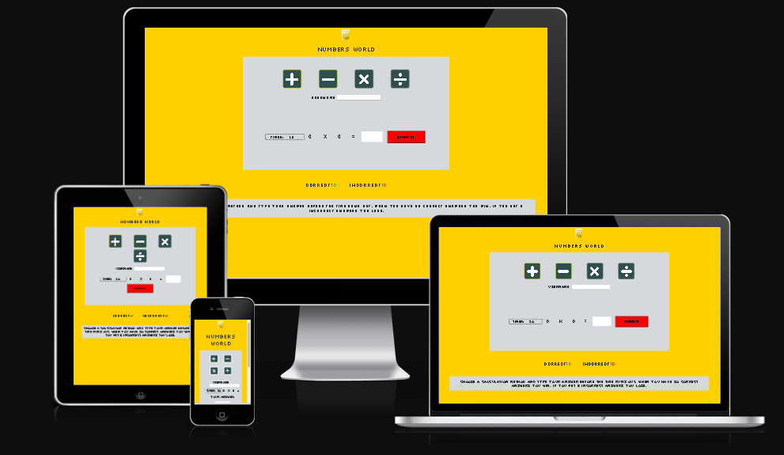

<h1 align="center">Numbers World</h1>
<h2 align="center">A web based maths game which tests the players basic knowledge</h2>

Table of Contents
- Site Owner Goals
- User Stories
- User Feedback
- Design
- Features
- Testing
- Deployment
- Technologies Used
- Credits
- Acknowledgements

  
## Site Owner Goals
- To offer easy and comprehensive maths learning.
- For the user to jog their basic math knowledge frequently.
- For the user to easily choose between the four calculation methods.
- To provide feedback to the user on the submitted answer.
- Helping the user to keep score of the progress in the game.
- To provide an easily accessible user interface.

## User Stories

 ### First Time User
 - The user will be able to start playing instantly.
 - No registration is required.
 - The user can put in the answer into the answer-box and get the result.
 - The user will get returning feedback instantly.

  
 ### Returning user
 - A returning user can easily start a new game.
 - The user will be familiar with the user interface and the rules of the game.
 - The player can always start a new game, but will not be able tu resume older games.
 - A returning user can improve on his or her math skills by frequent playing.  
 - As the game generates random numbers, the game will not be exhausted.
  
 ### Frequent user
 - A frequent user can easily navigate the user interface and get into the game. 
 - The user will improve on the skills rapidly, by practicing the calculation methods. 
 - The user will be comfortable with the rules of the game and keep score easily.
 
 ## User Feedback

## Design

### Imagery
- The game is very sparse on images. It has a few smaller pictures, though - one being the custom logotype and a favicon as well. The limited use of images in the game provides for maximum accessibility as the user will easily understand how to play the game. 

### Colour Scheme
- The colours for this game is based on the sleeve design of Kraftwerk's classic record "Computer World". Dominating values are of course yellow and grey, but there are also values of green, red and orange. The main goal with the choice of colours was to hint at the record and more specifically the songs "Numbers" and "Pocket Calculator". These colours, combined with the font, should provide a retro feel to the game as well. 

### Fonts
- For this game I chose the font "silkscreen", a Google font which was designed by Jason Kottke. This font has a very retro-styled character to it, which brings to mind old computer games from the 80's. 

### Layout

### Wireframes
- All wireframes were made with pen and paper.

## Features

### Landing Page

The landing page consists of a heading, a game section and a score section. The heading displays the name of the game as well as a logo. 

### Game Section

In the game section there are four buttons which gives the user the opportunity to choose between the four calculation methods. Below the buttons you find the randomly generated numbers together with the calculation method of choice. To the right you find the answer-box in which you can type the answer. The player can dial in the answer either with the keyboard or by using the arrows in the answer-box. To submit the answer the player can either click the "submit"button or hit "enter" on the keyboard. A popup-box will appear on the screen, displaying feedback to the user. If the answer is correct, the popup-box will say "You submitted the correct answer!". If the answer is wrong, the popup-box will tell the player the value of the answer and what the real answer is. For example if the player inaccurately submits the answer "31" to the numbers 16 + 16, the popup-box will say "Your answer is 31. The correct answer should be 32!" To contiue playing, the player can either click "OK" or hit "enter" and another challenge will appear. When the player wants to change calculation method, it's easily done by clicking another of the four buttons displaying the methods. The player is free to play as long as desired, as the game continuosly generates new numbers to calculate. 

#### Score section
In this section, the player can keep score of the progress of the game. The section consists of two areas - the "Correct"-area and the "Incorrect"-area. Every time the player submits a correct answer, the value in the "Correct"-area increases by "1". Every time the player submits an incorrect answer, the value in the "Incrrect"-area increases by "1". The values in the "Correct"-area has a green colour and the values in the "Incorrect"-area has a red colour.

### Features Left to Implement
-A popup window instead of an alert box.

## Testing

[Responsinator - link](http://www.responsinator.com/?url=https%3A%2F%2F8000-dym077-numbersgame1-mdgu2qm29xj.ws-eu107.gitpod.io%2F)

[Am I Responsive - link](https://ui.dev/amiresponsive?url=https://8000-dym077-numbersgame1-mdgu2qm29xj.ws-eu107.gitpod.io/)

### Validator Testing
 #### HTML
- HTML code was validated using [The W3C Markup Validator - link] (https://validator.w3.org/nu) which returned no errors or warnings.
    #### CSS
    - The CSS was tested with [The W3C CSS Validator - link](https://jigsaw.w3.org/css-validator/) and returned no errors or warnings.
    
#### Javascript
 - JavaScript code was tested with [JS Hint - link] https://jshint.com/ which returnes 21 warnings but no errors.
  
  

### Accessibility 

### Input Testing

### Button Testing

### Game Testing

### Browser Testing

    
### Device Testing

### Fixed Bugs

### Known Bugs
- No known bugs

## Technologies Used

### Languages
- JavaScript
- HTML5
- CSS

### Frameworks - Libraries - Programs Used

## Deployment
- The project was deployed to Github pages using the following steps:

1. Log into Github and locate the [Github repository](https://github.com/Dym077/numbers-game)
2. Click on the settings icon at the top of the repository.
3. Scroll down to the Github pages section  
4. Find the **source** select **main** by "Deply from a branch, next to "Root".
5. Click save, and refresh the page.

## Credits

### Content

### Media

### Resources Used

## Acknowledgments
- https://www.youtube.com/watch?v=AF6vGYIyV8M
